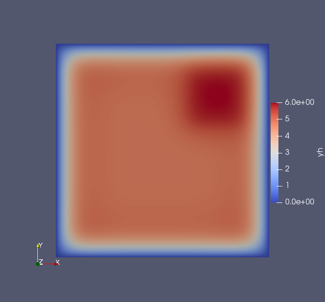

# PDE-contrained optimization
## Poisson-Boltzman problem

We consider here a 2D Poisson-Boltzmann problem
```math
\left\lbrace
\begin{aligned}
\min\limits_{y \in H_0^1(\Omega), u \in L^2(\Omega) } \  & \frac{1}{2}\int_{\Omega} |y - y_d(x)|^2 + \frac{1}{2}\alpha \int_\Omega |u|^2dx, \\
\text{ s.t. } & -\Delta y + \sinh{y} = h + u, \quad \text{in } \Omega:=(-1,1)^2,\\
                  & y = 0, \quad \text{in } \partial\Omega,
\end{aligned}
\right.
```
with the forcing term $h(x_1,x_2)=-\sin(\omega x_1) \sin(\omega x_2)$, $\omega = \pi - \frac{1}{8}$, and target state
```math
\begin{aligned}
    y_d(x) = \begin{cases}
    10 \quad \text{if } x \in [0.25,0.75]^2, \\
    5 \quad \text{otherwise}.
    \end{cases}
\end{aligned}
```

The implementation as a `GridapPDENLPModel` is given as follows.

```
    using Gridap, PDENLPModels
    #Domain
    n = 100
    model = CartesianDiscreteModel((-1,1,-1,1), (n,n))

    #Definition of the spaces:
    order = 1
    valuetype = Float64
    reffe = ReferenceFE(lagrangian, valuetype, order)
    Xpde = TestFESpace(
      model,
      reffe;
      conformity = :H1,
      dirichlet_tags="boundary",
    )
    Ypde = TrialFESpace(Xpde, 0.0)
    Xcon = TestFESpace(model, reffe; conformity = :L2)
    Ycon = TrialFESpace(Xcon)

    #Integration machinery
    trian = Triangulation(model)
    degree = 1
    dΩ = Measure(trian,degree)

    #Objective function:
    yd(x) = min(x[1]-0.25, 0.75-x[1],x[2]-0.25, 0.75-x[2])>=0. ? 10. : 5.
    function f(yu)
        y, u = yu
        ∫( 0.5 * (yd - y) * (yd - y) + 0.5 * 1e-4 * u * u )dΩ
    end

    #Definition of the constraint operator
    ω = π - 1/8
    h(x) = - sin(ω*x[1])*sin(ω*x[2])
    function res(y, u, v)
     ∫( ∇(v) ⊙ ∇(y) + operate(sinh, y)*v - u*v - v * h )dΩ
    end
    op = FEOperator(res, Y, Xpde)

    Y = MultiFieldFESpace([Ypde, Ycon])
    xin = zeros(Gridap.FESpaces.num_free_dofs(Y))
    nlp = GridapPDENLPModel(xin, f, trian, dΩ, Ypde, Ycon, Xpde, Xcon, op)
```

Then, one can solve the problem with Ipopt via [NLPModelsIpopt.jl](https://github.com/JuliaSmoothOptimizers/NLPModelsIpopt.jl) and plot the solution as a VTK file.
```
stats = ipopt(nlp, print_level = 0)
```
Switching again the discrete solution as a `FEFunction` the result can written as a VTK-file using Gridap's facilities.
```
yfv = stats.solution[1:Gridap.FESpaces.num_free_dofs(nlp.Ypde)]
yh  = FEFunction(nlp.Ypde, yfv)
ufv = stats.solution[1+Gridap.FESpaces.num_free_dofs(nlp.Ypde):end]
uh  = FEFunction(nlp.Ycon, ufv)
writevtk(nlp.tnrj.trian,"results",cellfields=["uh"=>uh, "yh"=>yh])
```
Finally, the solution is obtained using any software reading VTK, e.g. Paraview.


