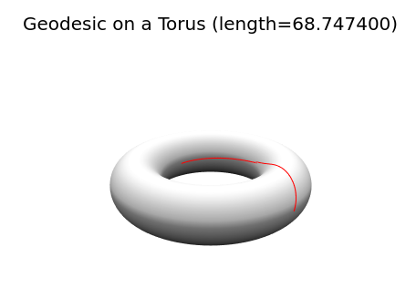

# Calculus of Variations
## The Brachistochrone over a Tore

In this example, we present how to model the classical brachistochrone problem over the torus with `PDENLPModels.jl` in polar coordinates. We want to model the following problem:
```math
\left\lbrace
\begin{aligned}
\min_{\varphi, \theta} \ & \ \int_0^1 a^2 \dot{\varphi}^2 + (c + a \cos(\varphi))^2 \dot{\theta}^2dt,\\
& \ 0 \leq \theta, \varphi \leq 2\pi,\\
& \ \varphi(0)= 0, \varphi(1)= \pi,\\
& \ \theta(0) = 0, \theta(1) = \pi,\\
\end{aligned}
\right.
```
with $a=1$ and $c=3$.

```
  using Gridap, PDENLPModels

  n = 100 #discretization size
  domain = (0,1) 
  model = CartesianDiscreteModel(domain, n)
      
  labels = get_face_labeling(model)
  add_tag_from_tags!(labels,"diri1",[2])
  add_tag_from_tags!(labels,"diri0",[1])

  x0 = zeros(2) # initial values
  xf = π * ones(2) # final values
  
  order = 1
  valuetype = Float64
  reffe = ReferenceFE(lagrangian, valuetype, order)
  V0 = TestFESpace(
    model,
    reffe;
    conformity = :H1,
    dirichlet_tags=["diri0","diri1"],
  )
  V1 = TestFESpace(
    model,
    reffe;
    conformity = :H1,
    dirichlet_tags=["diri0","diri1"],
  )
  
  U0  = TrialFESpace(V0, [x0[1], xf[1]])
  U1  = TrialFESpace(V0, [x0[2], xf[2]])
  
  V = MultiFieldFESpace([V0, V1])
  U = MultiFieldFESpace([U0, U1])
  nU0 = Gridap.FESpaces.num_free_dofs(U0)
  nU1 = Gridap.FESpaces.num_free_dofs(U1)
  
  trian = Triangulation(model)
  degree = 1
  dΩ = Measure(trian, degree)

  # The function under the integral:
  # To use the function cos in Gridap: `operate(cos, x)` vaut cos(x)
  # The square function is not available, so: `x*x` holds for $x^2$, 
  # and `∇(φ) ⊙ ∇(φ)` for `φ'^2`.
  a = 1
  c = 3
  function f(x)
    φ, θ = x
    ∫(a * a * ∇(φ) ⊙ ∇(φ) + (c + a * (cos ∘ φ)) * (c + a * (cos ∘ φ)) * ∇(θ) ⊙ ∇(θ))dΩ
  end

  # boundaries
  xmin = 0
  xmax = 2*π
  
  nlp = GridapPDENLPModel(
    zeros(nU0 + nU1),
    f,
    trian,
    U,
    V,
    lvar = xmin * ones(nU0+nU1),
    uvar = xmax * ones(nU0+nU1),
  )
```
Then, one can solve the problem with Ipopt via [NLPModelsIpopt.jl](https://github.com/JuliaSmoothOptimizers/NLPModelsIpopt.jl) and plot the solution.
```
using NLPModelsIpopt

stats = ipopt(nlp, print_level = 0)

nn = Int(nlp.pdemeta.nvar_pde/2)
φs = stats.solution[1:nn]
θs = stats.solution[nn+1:2*nn]

xs = (c .+ a * cos.(φs)) .* cos.(θs)
ys = (c .+ a * cos.(φs)) .* sin.(θs)
zs = a * sin.(φs)

L = stats.objective

plotlyjs()

linspace(from, to, npoints) = range(from, stop=to, length=npoints)

#plot a torus
M = 100
αs = linspace(0, 2π, M)
βs = linspace(0, 2π, M)
Xs = (c .+ a * cos.(αs)) * cos.(βs)'
Ys = (c .+ a * cos.(αs)) * sin.(βs)'
Zs = (a * sin.(αs)) * ones(M)'
plot3d(Xs, Ys, Zs, st=:surface, grid=false, c=:grays, axis=false, colorbar=false)
plot3d!(xs, ys, zs, linewidth=4, color=:red, title=@sprintf("Geodesic on a Torus (length=%4.f)", L), legend=false)
```
